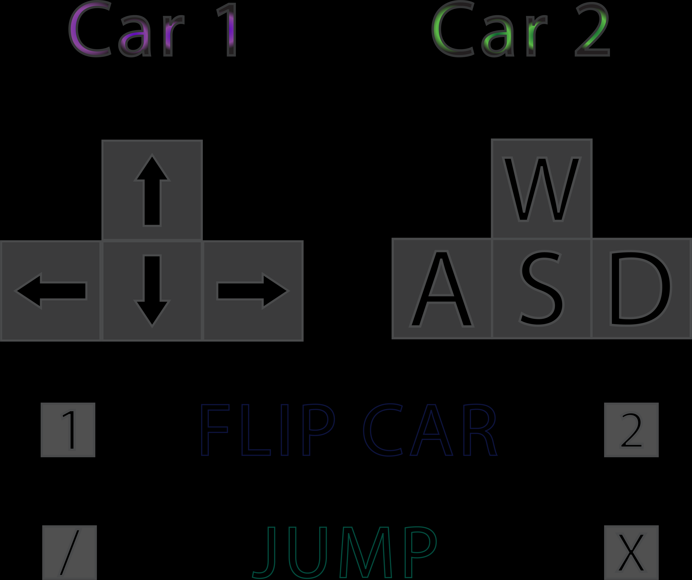

# WebGL Car Soccer Game

## Opis projektu

Stworzyliśmy grę, w której gracze mogą sterować samochodami, aby rzucać piłkę do bramki.

Inspiracją dla projektu była gra Rocket League, która, choć znacznie bardziej zaawansowana, opiera się na bardzo podobnej koncepcji rozgrywki.

Gracze mają możliwość pełnego sterowania samochodem za pomocą klawiatury lub kontrolera gier (testowane na DualShock 3).

Aby gra była ciekawsza, samochody mają możliwość skakania, a gracze mogą postawić pojazdy z powrotem na kołach, jeśli samochód się przewróci. Pełne instrukcje sterowania znajdują się w lewym dolnym rogu ekranu.

Po uderzeniu piłki do bramki przeciwnika wynik meczu ulega zmianie, a punkty są wyświetlane na tablicy wyników u góry strony.

## Link do strony projektu
benji-pooh.github.io/carballs/
## Opis techniczny

Kod skryptu odpowiedzialny za generowanie planszy znajduje się w pliku `js/script.js`.

### Obiekty 3D

W projekcie wykorzystaliśmy modele w formacie `.json` ładowane przez bibliotekę three.js. Zostały wygenerowane za pomocą Blendera i wyeksportowane w taki sposób, aby można je było poprawnie odczytać z pliku tekstowego.

Ze względu na ograniczone możliwości sprzętowe, wykorzystaliśmy trójwymiarowe modele low-poly drzew, aby rozgrywka była jak najbardziej płynna. Elementy stanowiące granice boiska zostały stworzone przez nas ręcznie w Blenderze.

Usunąłem oryginalną teksturę papieru, ponieważ nie wyglądała wystarczająco fajnie (moim zdaniem).

### Kamera

Użyliśmy kamery perspektywicznej (`PerspectiveCamera`), która podąża za punktem między dwoma graczami, a jej odległość zmienia się w taki sposób, aby pokazać obu graczy.

### Światło

W programie wykorzystano dwa źródła światła:

- `HemisphereLight` - odpowiada za ogólną jasność całej sceny
- `DirectionalLight` - dodaje cienie i mocniejsze oświetlenie od strony „słońca”

### Fizyka

Elementy fizyczne obliczane są na dwa sposoby:
- `ConvexMesh` - samochody - jest to dość intensywne obliczeniowo
- `BoxMesh/SphereMesh` - niższa (ale wystarczająca) dokładność granic piłki i planszy

### Zastosowane technologie i biblioteki

- Biblioteki Three.js i Physi.js
- Modele eksportowane za pomocą Blendera
- Biblioteka GameController do obsługi sterowania kontrolerem za pośrednictwem interfejsu API Gamepad przeglądarki. - Modele drzew: https://blendswap.com/blend/19242
- Modele samochodów: https://free3d.com/3d-model/low-poly-car--49763.html
- Modele zderzaków tworzone niezależnie w Blenderze

### Tryb debugowania

Po otwarciu strony z parametrem `?debug` w adresie znajdują się statystyki wyświetlania klatek na sekundę oraz panel z ustawieniami fizyki, które można zmieniać w trakcie gry.

[Strona gry - tryb debugowania (z parametrami i licznikiem FPS)](https://benji-pooh.github.io/carballs/?debug)

## Sterowanie grą

Gracz 1 może używać pada zamiast klawiatury. Pokazano obrazy klawiszy odpowiadających padom DualShock (PlayStation).

## Zrzuty ekranu

### Ekran rozgrywki

### Zdobycie punktu jest sygnalizowane zmianą koloru wiązki

## Podziękowania dla oryginalnych twórców:

- Karol Musur
- Jacek Nitychoruk
- Nieoficjalny fork autorstwa ben(@benpolb/benji-pooh)

(Użyłem tłumacza Google, aby to przetłumaczyć)
