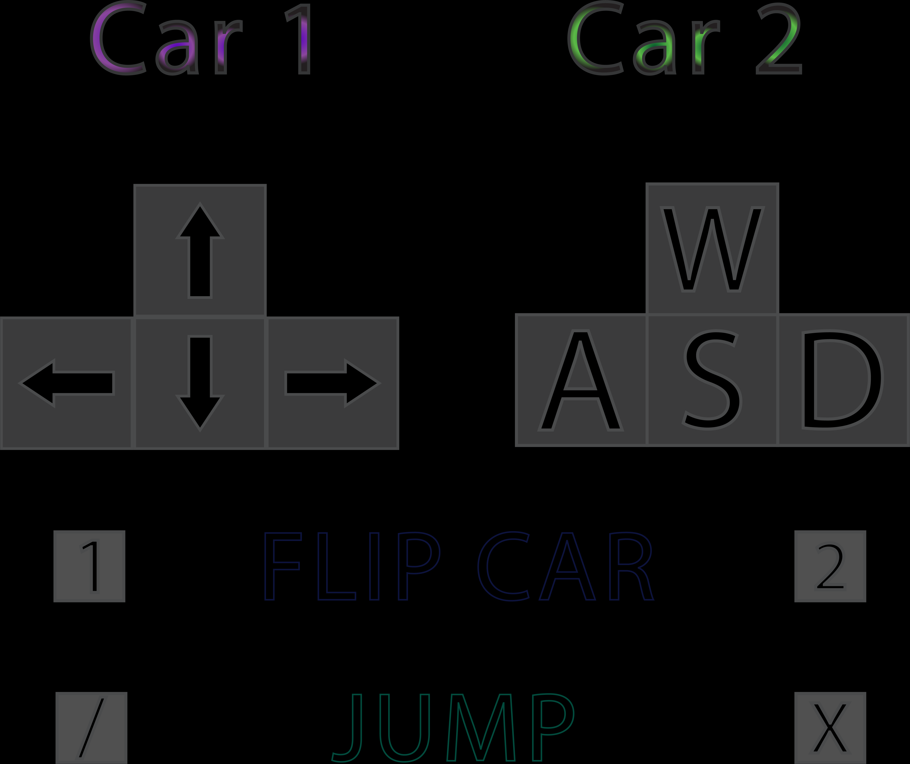

# WebGL Car Football Game

## Project description

As part of the project, we created a two-player browser game in WebGL technology, in which players, controlling toy cars, try to hit the ball into the opponent's goal.

The inspiration for the project was the game Rocket League, which, although much more advanced, is based on a similar gameplay concept.

Players have the ability to fully control the car using a keyboard or a game controller (tested on DualShock 3).

To make the game more interesting, cars have the ability to jump, and players can put the vehicles back on their wheels if the car falls over. Full control instructions are located in the lower left corner of the screen.

After hitting the ball into the opponent's goal, the match score changes and the points are displayed on the scoreboard at the top of the page.

## Link to the project page

[Game page](https://def-au1t.github.io/car-football/)

## Technical description

The script code responsible for generating the board is in the `js/script.js` file.

### 3D objects

In the project, we used models in the `.json` format loaded by the three.js library. They were generated using Blender and exported in such a way that they could be correctly read from a text file.

Due to limited hardware capabilities, we used three-dimensional low-poly models of trees to make the gameplay as smooth as possible. The elements constituting the boundaries of the pitch were created by us manually in Blender.

We decided that adding a paper texture to the ground would make the game - in combination with imported toy car models - have a currently popular cartoon character.

### Camera

We used a perspective camera (`PerspectiveCamera`) that follows a point between two players, and its distance changes in such a way as to show both players.

### Light

Two light sources were used in the program:

- `HemisphereLight` - responsible for the overall brightness of the entire scene
- `DirectionalLight` - adds shadows and stronger lighting from the "sun" side

### Physics

Physical elements are calculated in two ways:
- `ConvexMesh` - cars - this is quite computationally intensive
- `BoxMesh/SphereMesh` - lower (but sufficient) accuracy of the ball and board boundaries

### Technologies and libraries used

- Three.js & Physi.js libraries
- Models exported using Blender
- GameController library to support controller control via the browser Gamepad API.
- Tree models: https://blendswap.com/blend/19242
- Car models: https://free3d.com/3d-model/low-poly-car--49763.html
- Bumper models created independently in Blender

### Debug mode

After opening the page with the `?debug` parameter in the address, there are statistics of the display of frames per second, and a panel with physics settings, which can be changed during the game.

[Game page - debug mode (with parameters and FPS counter)](https://def-au1t.github.io/car-football/?debug)

## Game controls

Player 1 can use a pad instead of a keyboard. The images of the keys corresponding to the DualShock (PlayStation) pads are shown.

## Screenshots

### Gameplay screen

### Conquering a point is signaled by a change in the color of the beam

## Gameplay video
[Gameplay recording](https://aghedupl-my.sharepoint.com/:v:/g/personal/jaceknit_student_agh_edu_pl/EZ0lBYfSDKlPitFgiweSHDgBmz_ZQxFiYwwNoG-dRcNzVw?e=l1YkIb)

## Authors:

- Karol Musur
- Jacek Nitychoruk
